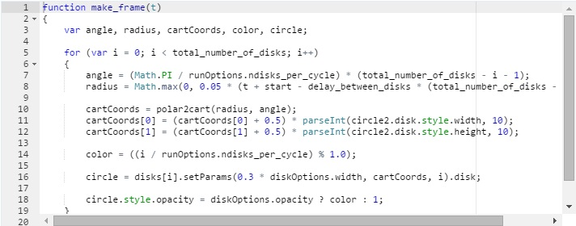
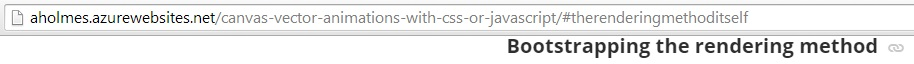
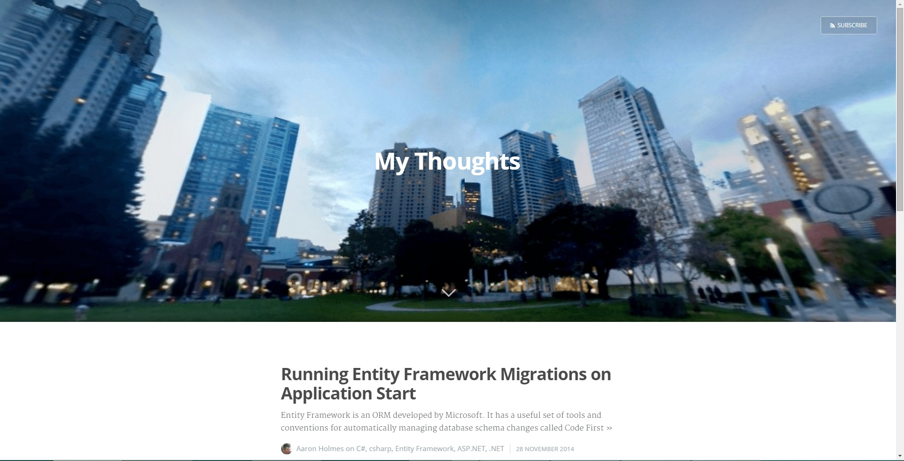
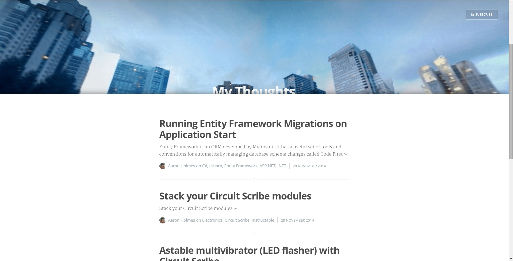

My Ghost theme; Casper for developers
=====================================

01 December 2014

I started using Ghost about a week ago. My (honest) first impression was that code blocks are unstyled and uneditable, which is a huge pet peeve of mine. I `fixed that <FIXME>`_ problem by forking Casper and adding Ace editor. You can find my fork of the theme here: https://github.com/aholmes/Casper.

For whatever reason, I still wasn't satisfied with things, so I kept changing bits. Here's a list of the changes I made, and what is available to you if you use this theme.

Hope you enjoy, and I will definitely accept pull requests if you send them!

* `Ace Editor <https://blog.aaronholmes.net/my-ghost-theme-a-fork-of-casper/#aceeditor>`_
* `Google+ comments <https://blog.aaronholmes.net/my-ghost-theme-a-fork-of-casper/#googlecomments>`_
* `Disqus comments <https://blog.aaronholmes.net/my-ghost-theme-a-fork-of-casper/#disquscomments>`_
* `Google Analytics <https://blog.aaronholmes.net/my-ghost-theme-a-fork-of-casper/#googleanalytics>`_
* `Linkable headers <https://blog.aaronholmes.net/my-ghost-theme-a-fork-of-casper/#linkableheaders>`_
* `Fixed-position header and footer across the site <https://blog.aaronholmes.net/my-ghost-theme-a-fork-of-casper/#fixedpositionheaderandfooteracrossthesite>`_

Ace editor
----------

As mentioned above, my first change was to add `Ace editor <http://ace.c9.io/>`_. You can see it in action in this post, but here's a screenshot as well.

Google+ comments
----------------

Casper, and Ghost in general, doesn't have a commenting system for posts out-of-the-box. My first pass at adding them was by adding some JS and CSS to use Google+'s commenting system.

This feature is optional in my theme.

`Code link <https://github.com/aholmes/Casper/blob/master/post.hbs#L76-L86>`_

.. code-block:: html

    <!-- Uncomment this to add Google Plus comments to your posts. -->  
    <!--div id="comments">
  
    <script>  
        (function ()
        {
            // Load G+ comments
            var po = document.createElement('script'); po.type = 'text/javascript'; po.async = true;
            po.src = 'https://apis.google.com/js/client:plusone.js?onload=gapiOnload';
            var s = document.getElementsByTagName('script')[0]; s.parentNode.insertBefore(po, s);
        })();
    </script-->

Disqus comments
---------------

I wasn't satisfied with Google+ comments, so I added this next. In `my branch <https://github.com/aholmes/Casper/tree/aholmes>`_ of this theme, I have Google+ comments disabled, and Disqus enabled.

This feature is optional in my theme.

Here's what the module looks like in each post's footer.

.. image:: _static/images/_my_ghost_theme_casper_for_developers/footer_capture.jpg
   
`Code link <https://github.com/aholmes/Casper/blob/master/post.hbs#L88-L98>`_
   
.. code-block:: html

    <!-- Uncomment this to add Disqus comments to your posts. -->  
    <!--div id="disqus_thread">
  
    <script type="text/javascript">  
        var disqus_shortname = 'REPLACE WITH DISQUS FORUM NAME';
        (function ()
        {
            var dsq = document.createElement('script'); dsq.type = 'text/javascript'; dsq.async = true;
            dsq.src = '//' + disqus_shortname + '.disqus.com/embed.js';
            (document.getElementsByTagName('head')[0] || document.getElementsByTagName('body')[0]).appendChild(dsq);
        })();
    </script-->  

Google Analytics
----------------

I wanted to track how much traffic my blog would get, so I added Google Analytics.

This feature is optional in my theme.

`Code link <https://github.com/aholmes/Casper/blob/master/default.hbs#L19-L32>`_

.. code-block:: html

    <!-- Uncomment this to enable Google Analytics. -->  
    <!--script>  
        (function (i, s, o, g, r, a, m)
        {
            i['GoogleAnalyticsObject'] = r; i[r] = i[r] || function ()
            {
            (i[r].q = i[r].q || []).push(arguments)
            }, i[r].l = 1 * new Date(); a = s.createElement(o),
            m = s.getElementsByTagName(o)[0]; a.async = 1; a.src = g; m.parentNode.insertBefore(a, m)
        })(window, document, 'script', '//www.google-analytics.com/analytics.js', 'ga');
        ga('create', 'CHANGE THIS TO YOUR KEY', 'auto');
        ga('send', 'pageview');
    </script-->  

Linkable headers
----------------

Casper was lacking a way to get the direct link to any headers in my posts. This feature shows a "link" icon when the header is hovered over. When the link is clicked, the URL hash is changed, and the link becomes "active." The currently linked-to header always displays the link until another header is clicked.

Here's what a header looks like when hovered over:

Here's what a header looks like when it's the active link:

.. image:: _static/images/_my_ghost_theme_casper_for_developers/active_link_header.jpg

Fixed-position header and footer across the site
------------------------------------------------

I found another theme I liked called `Decode for Ghost <https://github.com/ScottSmith95/Decode-for-Ghost>`_ that allowed blog content to flow over the header. It also didn't cause the header image to take up the entire screen on the home page (another pet peeve of mine). Unfortunately, I didn't like other parts of the theme, so I adopted the fixed header and footer idea to my fork of Casper.

This one is harder to capture with screenshots, but here they are anyway.

Here's what the home page looks like when first loaded. Notice that the image doesn't take over the entire screen.

Here's what the home page looks like when scrolled part way. Notice that the content covers the header, and the header has not moved at all.

Lastly, here's what the footer looks like. The content scrolls over this as well.

.. image:: _static/images/_my_ghost_theme_casper_for_developers/footer.jpg

.. tags:: Ghost