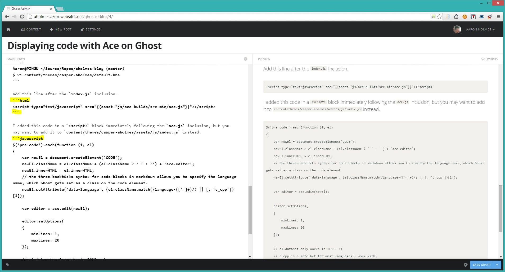

Displaying code with Ace on Ghost
=================================

28 November 2014

After getting Ghost set up, I was disappointed to see the lack of syntax highlighting in Casper's codeblocks. Additionally, code posted on sites where I can't copy, edit, or scroll around is a huge pet peeve of mine. I wanted to provide a usable codeblock for any readers of my site. Having used `Ace <http://ace.c9.io/>`_ before, I knew it did exactly what I was looking for. After some quick Googling and not finding a solution for this already, I decided to do it myself.

Update
------

You can skip all the work below and use my `theme <https://github.com/aholmes/Casper>`_, which includes these changes.

Adding Ace to your blog
-----------------------

First I copied the Casper theme to a new directory and created "my own" theme.

.. code-block:: bash

    Aaron@PINGU ~/Source/Repos/aholmes blog (master)  
    $ cd content/themes/

    Aaron@PINGU ~/Source/Repos/aholmes blog/content/themes (master)  
    $ cp -a casper/ casper-aholmes

Edit your "new" theme's package.json to give it a new name and version number.

.. code-block:: bash

    Aaron@PINGU ~/Source/Repos/aholmes blog/content/themes (master)  
    $ vi casper-aholmes/package.json

.. code-block:: json

    {
      "name": "Casper-aholmes",
      "version": "1.0"
    }

Change back to the root directory for your blog.

.. code-block:: bash

    Aaron@PINGU ~/Source/Repos/aholmes blog/content/themes (master)  
    $ cd -

    Aaron@PINGU ~/Source/Repos/aholmes blog (master)  
    $

Add Ace as a Git `submodule <http://git-scm.com/book/en/v2/Git-Tools-Submodules>`_.

.. code-block:: bash

    Aaron@PINGU ~/Source/Repos/aholmes blog (master)  
    $ git submodule add https://github.com/ajaxorg/ace-builds.git ./content/themes/casper-aholmes/assets/js/ace-builds

Then check out the latest `tagged <http://git-scm.com/book/en/v2/Git-Basics-Tagging>`_ version:

.. code-block:: bash

    Aaron@PINGU ~/Source/Repos/aholmes blog (master)  
    $ cd content/themes/casper-aholmes/assets/js/ace-builds/

    Aaron@PINGU ~/Source/Repos/aholmes blog/content/themes/casper-aholmes/assets/js/ace-builds (master)  
    $ git tag
    v1.0.0  
    v1.1.01  
    v1.1.1  
    v1.1.2  
    v1.1.3  
    v1.1.4  
    v1.1.5  
    v1.1.6  
    v1.1.7  
    v1.1.8

    Aaron@PINGU ~/Source/Repos/aholmes blog/content/themes/casper-aholmes/assets/js/ace-builds (master)  
    $ git checkout -b tags/v1.1.8 tags/v1.1.8
    Checking out files: 100% (1744/1744), done.  
    Switched to branch 'tags/v1.1.8'

    Aaron@PINGU ~/Source/Repos/aholmes blog/content/themes/casper-aholmes/assets/js/ace-builds (tags/v1.1.8)  
    $ cd -

Then we need to add the checked out tag to our repository.

.. code-block:: bash

    Aaron@PINGU ~/Source/Repos/aholmes blog (master)  
    $ git status
    # On branch master
    # Changes not staged for commit:
    #   (use "git add <file>..." to update what will be committed)
    #   (use "git checkout -- <file>..." to discard changes in working directory)
    #
    #       modified:   content/themes/casper-aholmes/assets/js/ace-builds (new commits)

    Aaron@PINGU ~/Source/Repos/aholmes blog (master)  
    $ git add content/themes/casper-aholmes/assets/js/ace-builds

    Aaron@PINGU ~/Source/Repos/aholmes blog (master)  
    $ git commit -m "Checked out v1.1.8 from ace-build repository."

Including Ace on your blog
--------------------------

Now that we have Ace available to us, we need to edit the default.hbs file to include ace.js on the page.

.. code-block:: bash

    Aaron@PINGU ~/Source/Repos/aholmes blog (master)  
    $ vi content/themes/casper-aholmes/default.hbs

Add this line after the ``index.js`` inclusion.

.. code-block:: html

      
    
Rendering code blocks with Ace
------------------------------

I added this code in a ``<script>`` block immediately following the ace.js inclusion, but you may want to add it to ``content/themes/casper-aholmes/assets/js/index.js`` instead.

.. code-block:: javascript

    $('pre code').each(function (i, el)
    {
        var newEl = document.createElement('CODE');
        newEl.className = el.className + (el.className ? ' ' : '') + 'ace-editor';
        newEl.innerHTML = el.innerHTML;
        // the three-backticks syntax for code blocks in markdown allows you to specify the language name, which Ghost gets set as a class on the code element.
        newEl.setAttribute('data-language', (el.className.match(/language-([^ ]+)/) || [, 'c_cpp'])[1]);

        var editor = ace.edit(newEl);

        editor.setOptions(
        {
            minLines: 1,
            maxLines: 20
        });

        // el.dataset only works in IE11. :(
        // c_cpp is a safe bet for most languages I work with.
        editor.session.setMode('ace/mode/' + newEl.getAttribute('data-language'));

        // Who needs <pre> when you have Ace? Replace the pre element with the newEl <code> element.
        $(el.parentElement).replaceWith(editor.container);
    });

This code replaces any instances of ``<pre><code>`` with a new ``<code>`` element that has been initialized with Ace after your site renders. It also supports using different syntax definitions, which you can control for your code blocks by using three backticks instead of tabs when writing your post. Of course, the options in ``setOptions()`` can be changed as well.

CSS Tweaks
----------

To override some CSS from Ghost, I needed to use the ``ace-editor`` class the JavaScript above adds for us. Open your ``content/themes/casper-aholmes/assets/css/screen.css`` file and add the following.

.. code-block:: css

    .ace-editor
    {
        display: block;
        width: 100%;
        line-height: normal;
        white-space: pre-wrap;
        -ms-word-break: break-all;
        word-break: break-all;
        border-radius: 0;
        padding: 0;
    }

I didn't like that my paragraphs following a code block would "stick" to the bottom of each code block, so I added this CSS to make each paragraph "stick" to the top of each code block following a paragraph. The same holds true for headers, but the margin is smaller.

.. code-block:: css

    .ace-editor + p
    {
        margin-top : 1.75em;
    }

    .ace-editor + h1,
    .ace-editor + h2,
    .ace-editor + h3,
    .ace-editor + h4,
    .ace-editor + h5,
    .ace-editor + h6
    {
        margin-top: 0.4em;
    }

    p + .ace-editor  
    {
        margin-top: -1.75em;
    }

    h1 + p,  
    h2 + p,  
    h3 + p,  
    h4 + p,  
    h5 + p,  
    h6 + p  
    {
        margin-top: -0.4em;
    }

.. tags:: Ghost, Ace, Theme, JavaScript, CSS